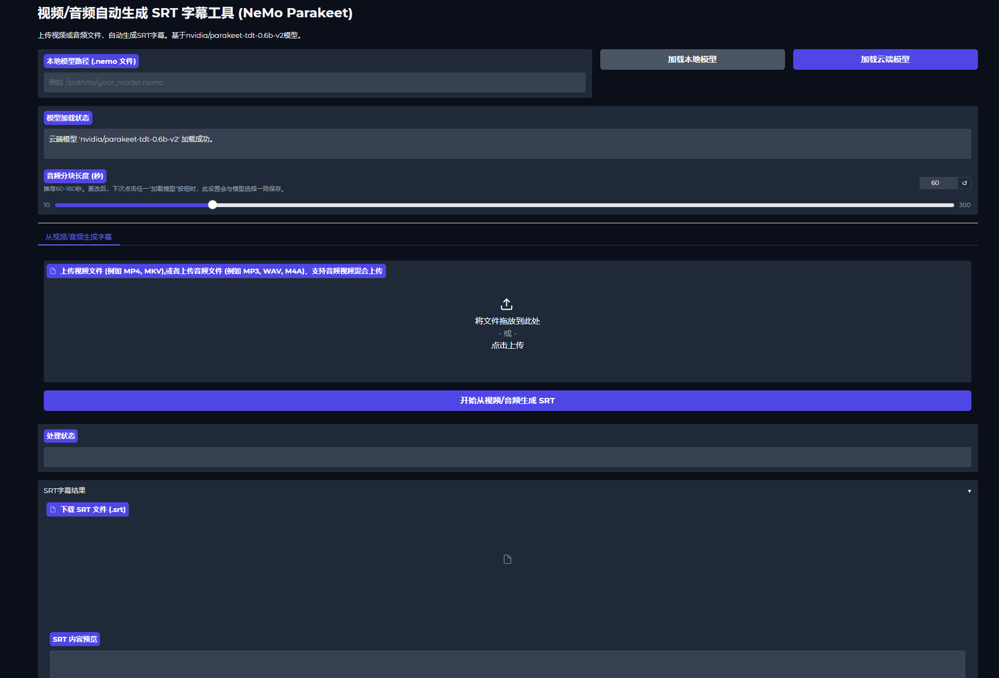

# parakeet-tdt-0.6b-v2-SRT-GUI - 基于 NeMo 的视频/音频SRT字幕生成工具
[English](./README.md)


本项目使用 nvidia/parakeet-tdt-0.6b-v2 ASR (自动语音识别) 模型，能够从视频或音频文件中自动生成带时间戳的 SRT 字幕文件。界面通过 Gradio 构建，方便用户上传文件并获取结果。

## 主要功能

*   从多种常见的视频格式 (如 MP4, MKV, AVI 等) 提取音频并生成SRT字幕。
*   直接处理多种常见的音频格式 (如 MP3, WAV, M4A, FLAC 等) 生成SRT字幕。
*   支持长视频和长音频输入
*   支持加载 NVIDIA NGC 上的预训练 Parakeet 云端模型 (默认 `nvidia/parakeet-tdt-0.6b-v2`)。
*   支持加载用户本地的 `.nemo` 模型文件。
*   可调节音频处理的分块长度，以在速度和上下文连贯性之间取得平衡。
*   自动检测 CUDA GPU，优先使用 GPU 进行加速处理；若无 GPU，则在 CPU 上运行 (速度较慢)。
*   用户界面友好，操作简单。
*   自动保存用户选择的模型和分块长度配置。
*   支持批量转录和混合处理视频/音频文件


## 环境要求

*   Python 3.12.2 或更高版本，确保兼容最新的 NeMo 库
*   **FFmpeg**: 用于音视频编解码和格式转换。**必须单独安装并配置到系统 PATH 环境变量中。**
*   NVIDIA GPU (推荐，用于加速，需要 CUDA驱动)。如果无 GPU，也可以在 CPU 上运行，但速度会非常慢。

## 简化版安装步骤(windows)

1.  **克隆本仓库:**
    ```bash
    git clone https://github.com/NINIYOYYO/parakeet-tdt-0.6b-v2-SRT-GUI.git
    ```

2.  **双击打开install_dependencies.bat**
    它会创建并激活Python 虚拟环境同时检查和安装依赖
    torch的安装要看你是否需要GPU进行加速
    

3.  **安装 FFmpeg:**
    本项目依赖 FFmpeg 进行音频提取和预处理。你需要单独安装它，并确保其可执行文件路径已添加到系统的 PATH 环境变量中。
    *   **Windows:**
        1.  从 FFmpeg 官网下载页面 ([https://ffmpeg.org/download.html](https://ffmpeg.org/download.html)) 下载预编译版本 (例如，来自 "gyan.dev" 或 "BtbN" 的构建)。
        2.  解压下载的文件。
        3.  将解压后文件夹内的 `bin` 目录路径 (例如 `C:\ffmpeg\bin`) 添加到系统环境变量 `Path` 中。
    *   **Linux (Ubuntu/Debian 等):**
        ```bash
        sudo apt update && sudo apt install ffmpeg
        ```
    *   **macOS (使用 Homebrew):**
        ```bash
        brew install ffmpeg
        ```

3. **双击打开launcher.bat**
    如果你的环境和依赖都安装好了，双击打开lancher.bat就可以直接运行此项目了


## 安装步骤

1.  **克隆本仓库:**
    ```bash
    git clone https://github.com/NINIYOYYO/parakeet-tdt-0.6b-v2-SRT-GUI.git
    ```

2.  **创建并激活 Python 虚拟环境 (强烈推荐):**
    ```bash
    python -m venv .venv
    ```
    *   Windows:
        ```bash
        .\.venv\Scripts\activate
        ```
    *   macOS / Linux:
        ```bash
        source .venv/bin/activate
        ```

3.  **安装 PyTorch (重要：GPU 用户请特别注意!):**
    如果你希望使用 NVIDIA GPU 进行加速处理 (强烈推荐)，**请务必在安装其他依赖项之前，先手动安装一个与你的 CUDA 环境兼容的 PyTorch 版本。**
    *   输入Win+R键打开windows系统的运行窗口输入CMD进入终端输入
    ```bash
    nvidia-smi
    ```
    并且回车来检查你的 CUDA Version:
    *   访问 [PyTorch 官网安装指引页面](https://pytorch.org/get-started/locally/)。
    *   根据你的操作系统、包管理器 (推荐 `pip`)、计算平台 (例如 CUDA 11.8, CUDA 12.1) 和 Python 版本选择正确的安装命令。
    *   例如，如果使用 `pip` 且你的系统有 CUDA 12.1 环境，可以运行：
        ```bash
        pip3 install torch torchvision torchaudio --index-url https://download.pytorch.org/whl/cu121
        ```
    如果跳过此步骤，或者你的系统没有 NVIDIA GPU，后续安装的 `nemo_toolkit` 可能会默认安装仅支持 CPU 的 PyTorch 版本。

4.  **安装项目依赖:**
    在激活虚拟环境并（可选地）安装好特定版本 PyTorch 后，运行：
    ```bash
    pip install -r requirements.txt
    ```
    (`requirements.txt` 内容示例见下方)

5.  **安装 FFmpeg:**
    本项目依赖 FFmpeg 进行音频提取和预处理。你需要单独安装它，并确保其可执行文件路径已添加到系统的 PATH 环境变量中。
    *   **Windows:**
        1.  从 FFmpeg 官网下载页面 ([https://ffmpeg.org/download.html](https://ffmpeg.org/download.html)) 下载预编译版本 (例如，来自 "gyan.dev" 或 "BtbN" 的构建)。
        2.  解压下载的文件。
        3.  将解压后文件夹内的 `bin` 目录路径 (例如 `C:\ffmpeg\bin`) 添加到系统环境变量 `Path` 中。
    *   **Linux (Ubuntu/Debian 等):**
        ```bash
        sudo apt update && sudo apt install ffmpeg
        ```
    *   **macOS (使用 Homebrew):**
        ```bash
        brew install ffmpeg
        ```
6. **双击打开launcher.bat**
    如果你的环境和依赖都安装好了，双击打开lancher.bat就可以直接运行此项目了


## 从本地加载模型
**如果你想从本地加载nvidia/parakeet-tdt-0.6b-v2模型，初次启动时，在本地模型路径 (.nemo 文件)输入模型的本地路径**
**例如 C:\Users\models--nvidia--parakeet-tdt-0.6b-v2\snapshots\30c5e6f557f6ba26e5819a9ed2e86f670186b43f\parakeet-tdt-0.6b-v2.nemo**
    


## 界面展示



## 使用方法

确保你已按照上述步骤完成环境配置和依赖安装。

在项目根目录下，运行主脚本：

启动方式分两种
1. **运行launcher.bat进行启动**

2. **在终端启动(进入虚拟环境)**
    ```bash
    python main.py
    ```


脚本启动后，会在终端打印出一个本地 URL (通常是 http://127.0.0.1:7860 或类似地址)。在浏览器中打开此 URL 即可访问 Gradio 用户界面。

模型选择与加载:

本地模型: 在 "本地模型路径" 输入框中填写你的 .nemo 模型文件的完整路径，然后点击 "加载本地模型" 按钮。

云端模型: 直接点击 "加载云端模型" 按钮，将从 NVIDIA NGC 下载并加载默认的 Parakeet 模型。

模型加载状态会显示在下方的文本框中。

调整音频分块长度:
使用滑块调整 "音频分块长度 (秒)"。较大的分块可以保留更多上下文，但可能增加处理时间和内存消耗。推荐范围为 60-180 秒。此设置会在下次点击任一“加载模型”按钮时与模型选择一同保存。

上传文件并生成字幕:

从视频生成: 切换到 "从视频生成字幕" 标签页，点击视频上传区域上传你的视频文件，然后点击 "开始从视频生成 SRT" 按钮。

从音频生成: 切换到 "从音频生成字幕" 标签页，点击音频上传区域上传你的音频文件，然后点击 "开始从音频生成 SRT" 按钮。

查看和下载结果:

处理状态会实时更新。

处理完成后，你可以在 "SRT字幕结果"区域预览生成的字幕内容，并点击 "下载 SRT 文件" 链接下载 .srt 字幕文件。

注意事项

处理大型文件或在 CPU 上运行时，可能需要较长时间，请耐心等待。

首次加载云端模型时，需要下载模型文件，耗时取决于你的网络速度。

如果遇到 ffmpeg 相关错误，请确保已正确安装并配置了 FFmpeg。

如果脚本提示在 CPU 上运行，但你拥有 NVIDIA GPU 并希望使用它，请仔细检查 PyTorch 是否已正确安装为 CUDA 版本（参考“安装步骤”第3点）。

